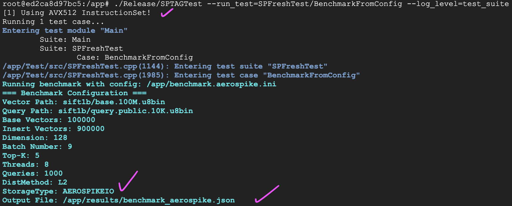
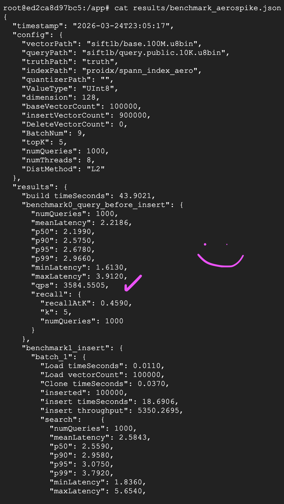

# Distributed KV Database for SPTAG

Welcome to the project repository focused on BUilding and Integrating Aerospike into SPTAG. 

## Index

1. [Setup Guidance](#1-setup-guidance)
   - [Build 3 Aerospike Nodes](#aerospike-3-node-cluster-on-gcp)
   - [Build 1 SPTAG Node](#setting-up-a-single-sptag-node)
   - [Run Aerospike benchmarks](#run-aerospike-benchmarks) *(server-side UDF modes require §6 first)*
     - [UDF search benchmarks: env or script](#udf-search-benchmarks-env-or-script)
2. [Benchmarks](#2-benchmarks-aerospike-only)
3. [Aerospike UDFs: design and current status](#3-aerospike-udfs-design-and-current-status)
4. [Registering UDFs on remote Aerospike nodes](#4-registering-udfs-on-remote-aerospike-nodes) *(prerequisite for Packed / Pairs modes)*

---
### Why Aerospike?

The vector-search workload is heavily **read-dominated** (many queries per write), so predictable read latency matters more than single-node strong consistency. Aerospike keeps a **primary index in DRAM** (each 64-byte entry points at the record’s on-disk location), so a lookup is a memory hit plus typically **one** storage read, without LSM-style level walks. The storage engine can use **direct I/O** on raw devices (for example local NVMe), which avoids double-buffering in the page cache and helps keep tail latency stable for large postings. This combination fits ANN serving where we need high QPS, bounded latency, and horizontal scale.

---

## 1) Setup Guidance

### Aerospike 3-Node Cluster on GCP

This guide walks through how to recreate a 2-node Aerospike cluster on Google Cloud using a deployment script.  
This setup will:

- Create 3 Google Compute Engine VMs
- Install Aerospike automatically on both
- Configure them as a 3-node cluster
- Use local NVMe SSD storage
- Open the required internal firewall ports for Aerospike traffic

#### Prerequisites

Before starting, ensure:

- You have access to a Google Cloud project with billing enabled.
- Compute Engine API is enabled You can run the following command in the Google Cloud Shell: (`gcloud services enable compute.googleapis.com`).
- You are using **Google Cloud Shell** or have `gcloud` installed locally.

#### Deployment Steps

**1. Find and Set Your Project**

You can find your GCP project ID in the Google Cloud Console as shown in the screenshot below:


Alternatively, you can list all your projects using (though this might output all of the BU projects for you):

**Run in Google Cloud Shell:**

```bash
gcloud projects list
```

> [!NOTE]
> Note your Project_ID, you will need it for the next step.

then run:

```bash
gcloud config set project YOUR_PROJECT_ID
gcloud config get-value project
```

**2. Create the Deployment Script**  
Create a file named `deploy-aerospike.sh` and paste the following bash script into it. 

> [!IMPORTANT]
> Make sure to edit the `PROJECT_ID` and `ZONE` at the top of the file to match your environment.
> The below scripts are to be ran on Google Cloud Shell (see the screenshot below)


```bash
#!/bin/bash
set -euo pipefail

# =========================
# USER-EDITABLE SETTINGS
# =========================
# Set your GCP project, zone, VM specs, cluster names, and Aerospike package details here before running.
PROJECT_ID="YOUR-PROJECT-NAME"
ZONE="us-east4-b"
MACHINE_TYPE="n2-standard-4"
IMAGE_FAMILY="ubuntu-2404-lts-amd64"
IMAGE_PROJECT="ubuntu-os-cloud"
CLUSTER_NAME="sptag-cluster"
NAMESPACE_NAME="sptag_data"
NVME_DEVICE="/dev/disk/by-id/google-local-nvme-ssd-0"
NODE1="aerospike-node-1"
NODE2="aerospike-node-2"
NODE3="aerospike-node-3"
AEROSPIKE_URL="https://download.aerospike.com/artifacts/aerospike-server-community/8.1.1.1/aerospike-server-community_8.1.1.1_tools-12.1.1_ubuntu24.04_x86_64.tgz"
AEROSPIKE_DIR="aerospike-server-community_8.1.1.1_tools-12.1.1_ubuntu24.04_x86_64"

# Stop if the placeholder project ID was not changed.
if [[ "$PROJECT_ID" == "your-gcp-project-id" ]]; then
  echo "Please edit PROJECT_ID at the top of the script before running."
  exit 1
fi

# Set the active gcloud project so all following compute commands run against the correct project.
gcloud config set project "${PROJECT_ID}"

# Create a firewall rule that allows Aerospike nodes with the aerospike tag to talk to each other on the needed ports.
gcloud compute firewall-rules create aerospike-internal \
  --network=default \
  --allow tcp:3000-3004 \
  --source-tags=aerospike \
  --target-tags=aerospike || true
s
# =========================
# WRITE VM STARTUP SCRIPT
# =========================
# This creates the startup script that each VM will run automatically on first boot to install and configure Aerospike.
cat > startup-aerospike.sh <<'EOF'
#!/bin/bash
set -euxo pipefail

# Send all startup-script output into a log file so installation and config issues can be debugged later.
exec > /var/log/startup-aerospike.log 2>&1
export DEBIAN_FRONTEND=noninteractive

# Read cluster settings from the VM metadata so the same startup script can configure both nodes dynamically.
CLUSTER_NAME="$(curl -fs -H 'Metadata-Flavor: Google' \
  http://metadata.google.internal/computeMetadata/v1/instance/attributes/cluster-name)"
NAMESPACE_NAME="$(curl -fs -H 'Metadata-Flavor: Google' \
  http://metadata.google.internal/computeMetadata/v1/instance/attributes/namespace-name)"
SEED_IPS_RAW="$(curl -fs -H 'Metadata-Flavor: Google' \
  http://metadata.google.internal/computeMetadata/v1/instance/attributes/seed-ips || true)"
NVME_DEVICE="$(curl -fs -H 'Metadata-Flavor: Google' \
  http://metadata.google.internal/computeMetadata/v1/instance/attributes/nvme-device)"
AEROSPIKE_URL="$(curl -fs -H 'Metadata-Flavor: Google' \
  http://metadata.google.internal/computeMetadata/v1/instance/attributes/aerospike-url)"
AEROSPIKE_DIR="$(curl -fs -H 'Metadata-Flavor: Google' \
  http://metadata.google.internal/computeMetadata/v1/instance/attributes/aerospike-dir)"

# Install the tools needed to download, unpack, and prepare the Aerospike package.
apt-get update
apt-get install -y wget curl python3 tar util-linux

# Wipe the local NVMe SSD if it exists so Aerospike can use a clean device for storage.
if [ -b "$NVME_DEVICE" ]; then
    echo "Wiping NVMe device $NVME_DEVICE..."
    blkdiscard "$NVME_DEVICE" || true
fi

# Download and install Aerospike only if it is not already installed on the VM.
if [ ! -d "/opt/aerospike/bin" ]; then
    mkdir -p /opt/aerospike
    wget "$AEROSPIKE_URL" -O /tmp/aerospike.tgz
    tar -xzf /tmp/aerospike.tgz -C /tmp
    cd "/tmp/$AEROSPIKE_DIR"
    ./asinstall
fi

# Make sure the Aerospike config and log directories exist after installation.
mkdir -p /etc/aerospike
mkdir -p /var/log/aerospike
chown -R aerospike:aerospike /var/log/aerospike || true

# Give the Aerospike user access to the NVMe device so the database can use it as its storage engine.
if [ -b "$NVME_DEVICE" ]; then
    chown aerospike:aerospike "$(readlink -f "$NVME_DEVICE")" || true
    usermod -aG disk aerospike || true
fi

# Build heartbeat seed lines from the metadata-provided IP list so this node can discover the other cluster member.
SEED_LINES=""
if [[ -n "${SEED_IPS_RAW}" ]]; then
  IFS=',' read -ra SEEDS <<< "${SEED_IPS_RAW}"
  for ip in "${SEEDS[@]}"; do
    [[ -n "${ip}" ]] && SEED_LINES="${SEED_LINES}        mesh-seed-address-port ${ip} 3003"$'\n'
  done
fi

# Write the Aerospike server configuration using the metadata values and generated seed list.
cat > /etc/aerospike/aerospike.conf <<CONF
service {
    cluster-name ${CLUSTER_NAME}
    proto-fd-max 15000
}

logging {
    file /var/log/aerospike/aerospike.log {
        context any info
    }
}

network {
    service {
        address any
        port 3000
    }

    fabric {
        address any
        port 3001
    }

    heartbeat {
        mode mesh
        address any
        port 3003
        interval 150
        timeout 10
${SEED_LINES}    }

    admin {
        address any
        port 3004
    }
}

namespace ${NAMESPACE_NAME} {
    replication-factor 2
    default-ttl 0
    indexes-memory-budget 4G

    storage-engine device {
        device ${NVME_DEVICE}
    }
}
CONF

# Reload systemd, enable Aerospike at boot, and start the database service now.
systemctl daemon-reload
systemctl enable aerospike
systemctl start aerospike
EOF

# Make the generated startup script executable so GCP can run it during VM boot.
chmod +x startup-aerospike.sh

# =========================
# CREATE NODE 1
# =========================
# Create the first Aerospike VM. It starts with no seed IPs because it is the initial cluster member.
echo "Creating ${NODE1}..."
gcloud compute instances create "${NODE1}" \
  --project="${PROJECT_ID}" \
  --zone="${ZONE}" \
  --machine-type="${MACHINE_TYPE}" \
  --image-family="${IMAGE_FAMILY}" \
  --image-project="${IMAGE_PROJECT}" \
  --boot-disk-size=30GB \
  --boot-disk-type=pd-balanced \
  --local-ssd=interface=nvme \
  --tags=aerospike \
  --metadata=cluster-name="${CLUSTER_NAME}",namespace-name="${NAMESPACE_NAME}",seed-ips="",nvme-device="${NVME_DEVICE}",aerospike-url="${AEROSPIKE_URL}",aerospike-dir="${AEROSPIKE_DIR}" \
  --metadata-from-file=startup-script=./startup-aerospike.sh

# Wait briefly so node 1 has time to boot and get assigned its internal IP address.
echo "Waiting for ${NODE1} IP..."
sleep 40

# Read node 1’s internal IP so it can be passed as the seed IP when creating node 2.
NODE1_IP=$(gcloud compute instances describe "${NODE1}" \
  --project="${PROJECT_ID}" \
  --zone="${ZONE}" \
  --format="get(networkInterfaces[0].networkIP)")

# Print node 1’s internal IP for visibility and later troubleshooting.
echo "${NODE1} internal IP: ${NODE1_IP}"

# =========================
# CREATE NODE 2
# =========================
# Create the second Aerospike VM and give it node 1’s internal IP as its heartbeat seed.
echo "Creating ${NODE2}..."
gcloud compute instances create "${NODE2}" \
  --project="${PROJECT_ID}" \
  --zone="${ZONE}" \
  --machine-type="${MACHINE_TYPE}" \
  --image-family="${IMAGE_FAMILY}" \
  --image-project="${IMAGE_PROJECT}" \
  --boot-disk-size=30GB \
  --boot-disk-type=pd-balanced \
  --local-ssd=interface=nvme \
  --tags=aerospike \
  --metadata=cluster-name="${CLUSTER_NAME}",namespace-name="${NAMESPACE_NAME}",seed-ips="${NODE1_IP}",nvme-device="${NVME_DEVICE}",aerospike-url="${AEROSPIKE_URL}",aerospike-dir="${AEROSPIKE_DIR}" \
  --metadata-from-file=startup-script=./startup-aerospike.sh

# Wait briefly so node 2 can boot and receive its internal IP.
echo "Waiting for ${NODE2} IP..."
sleep 40

# Read node 2’s internal IP so node 1 and node 3 can later be updated.
NODE2_IP=$(gcloud compute instances describe "${NODE2}" \
  --project="${PROJECT_ID}" \
  --zone="${ZONE}" \
  --format="get(networkInterfaces[0].networkIP)")

# Print node 2’s internal IP for confirmation and debugging.
echo "${NODE2} internal IP: ${NODE2_IP}"

# =========================
# CREATE NODE 3 
# =========================
echo "${NODE1_IP},${NODE2_IP}" > node3-seeds.txt

echo "Creating ${NODE3}..."
gcloud compute instances create "${NODE3}" \
  --project="${PROJECT_ID}" \
  --zone="${ZONE}" \
  --machine-type="${MACHINE_TYPE}" \
  --image-family="${IMAGE_FAMILY}" \
  --image-project="${IMAGE_PROJECT}" \
  --boot-disk-size=30GB \
  --boot-disk-type=pd-balanced \
  --local-ssd=interface=nvme \
  --tags=aerospike \
  --metadata="cluster-name=${CLUSTER_NAME},namespace-name=${NAMESPACE_NAME},nvme-device=${NVME_DEVICE},aerospike-url=${AEROSPIKE_URL},aerospike-dir=${AEROSPIKE_DIR}" \
  --metadata-from-file="startup-script=./startup-aerospike.sh,seed-ips=./node3-seeds.txt"

rm node3-seeds.txt

echo "Waiting for ${NODE3} IP..."
sleep 40

# Read node 3’s internal IP.
NODE3_IP=$(gcloud compute instances describe "${NODE3}" \
  --project="${PROJECT_ID}" \
  --zone="${ZONE}" \
  --format="get(networkInterfaces[0].networkIP)")

# Print node 3’s internal IP for confirmation and debugging.
echo "${NODE3} internal IP: ${NODE3_IP}"

# Give existing nodes additional time to finish their installs before rewriting and restarting configs.
echo "Waiting for Aerospike to finish installing on ${NODE1} and ${NODE2}..."
sleep 60

# =========================
# UPDATE NODE 1 & 2 SEEDS
# =========================
# Rewrite node 1 and 2 Aerospike configs so they include the full mesh, then restart Aerospike.

echo "Updating ${NODE1} config for full 3-node mesh..."
gcloud compute ssh "${NODE1}" \
  --project="${PROJECT_ID}" \
  --zone="${ZONE}" \
  --command "sudo bash -c '
cat > /etc/aerospike/aerospike.conf <<CONF
service {
    cluster-name ${CLUSTER_NAME}
    proto-fd-max 15000
}

logging {
    file /var/log/aerospike/aerospike.log {
        context any info
    }
}

network {
    service {
        address any
        port 3000
    }

    fabric {
        address any
        port 3001
    }

    heartbeat {
        mode mesh
        address any
        port 3003
        interval 150
        timeout 10
        mesh-seed-address-port ${NODE2_IP} 3003
        mesh-seed-address-port ${NODE3_IP} 3003
    }

    admin {
        address any
        port 3004
    }
}

namespace ${NAMESPACE_NAME} {
    replication-factor 2
    default-ttl 0
    indexes-memory-budget 4G

    storage-engine device {
        device ${NVME_DEVICE}
    }
}
CONF
systemctl restart aerospike
'"

echo "Updating ${NODE2} config for full 3-node mesh..."
gcloud compute ssh "${NODE2}" \
  --project="${PROJECT_ID}" \
  --zone="${ZONE}" \
  --command "sudo bash -c '
cat > /etc/aerospike/aerospike.conf <<CONF
service {
    cluster-name ${CLUSTER_NAME}
    proto-fd-max 15000
}

logging {
    file /var/log/aerospike/aerospike.log {
        context any info
    }
}

network {
    service {
        address any
        port 3000
    }

    fabric {
        address any
        port 3001
    }

    heartbeat {
        mode mesh
        address any
        port 3003
        interval 150
        timeout 10
        mesh-seed-address-port ${NODE1_IP} 3003
        mesh-seed-address-port ${NODE3_IP} 3003
    }

    admin {
        address any
        port 3004
    }
}

namespace ${NAMESPACE_NAME} {
    replication-factor 2
    default-ttl 0
    indexes-memory-budget 4G

    storage-engine device {
        device ${NVME_DEVICE}
    }
}
CONF
systemctl restart aerospike
'"

# Print a blank line and a final status message once all nodes are created and the seed updates are complete.
echo
echo "Done."

# Show the final VM names, internal IPs, and status values so you can confirm all nodes exist and are running.
echo "Cluster nodes:"
gcloud compute instances list --project="${PROJECT_ID}" --filter="tags.items=aerospike" --format="table(name,networkInterfaces[0].networkIP,status)"

# Print a ready-to-run verification command to check Aerospike cluster info from node 1.
echo
echo "Verify with:"
echo "gcloud compute ssh ${NODE1} --zone ${ZONE} --project ${PROJECT_ID} --command 'asadm -e \"info\"'"


```

**3. Run the Script**

```bash
chmod +x deploy-aerospike.sh
./deploy-aerospike.sh
```

**4. Verification and Testing**  
SSH into a node:

```bash
gcloud compute ssh aerospike-node-1 --zone us-east4-b
```

> [!IMPORTANT]
> Now you should be SSHed into a node! So the following commands should be ran from the nodes themselves.

**Run on an Aerospike node after SSHing in:**

Check status:

```bash
systemctl status aerospike --no-pager
asadm -e "info"  # Should output 3 nodes, cluster formed!
```

You should see something like this:


Test Read/Write (AQL):

```bash
aql
# Inside the AQL shell:
INSERT INTO sptag_data.testset (PK, bin1) VALUES ('key1', 'hello');
SELECT * FROM sptag_data.testset WHERE PK='key1';
```

*(You can verify cross-node communication by running the* `SELECT` *command from the second Aerospike node.)*


**Troubleshooting**  
The most important log for startup issues is `/var/log/startup-aerospike.log`.   
If something fails heavily, you can wipe the cluster and start fresh:

```bash
gcloud compute instances delete aerospike-node-1 aerospike-node-2 --zone us-east4-b
gcloud compute firewall-rules delete aerospike-internal
```

---

### Setting Up a Single SPTAG Node

To provision a single high-performance VM and run the environment via Docker, execute the following:

#### Provision the GCP Instance

> [!IMPORTANT]
> The following command should be ran in the Google Shell, not the aerospike node shell.

In the Google Cloud Shell (press G and S in the google cloud VM-instance window):

**Run in Google Cloud Shell:**

```bash
# 1. Provision the GCP Instance
gcloud compute instances create sptag-node \
    --zone=us-east4-b \
    --machine-type=c2-standard-8 \
    --subnet=default \
    --tags=http-server,https-server \
    --create-disk=auto-delete=yes,boot=yes,size=250GB,type=pd-standard,image-family=ubuntu-2404-lts-amd64,image-project=ubuntu-os-cloud \
    --local-ssd=interface=NVME \
    --scopes=default \
    --labels=goog-ops-agent=v2-x86-template
```

---

#### Prepare the SPTAG VM and Docker Environment

Then SSH into the provisioned VM, and run the following:

> [!NOTE]
> When you get to the Docker Build Phase, do not worry about the red text - those are warnings that came along with the SPTAG codebase. We also have unused methods which cause warnings, but they do not affect the ability of the code to run.

**Run on the provisioned SPTAG VM after SSHing in:**

```bash
# 1. Install all of the required tools (git, Docker, etc.):
sudo apt-get update
sudo apt-get install -y \
    git \
    build-essential \
    cmake \
    apt-utils \
    docker.io \
    pkg-config \
    libssl-dev \
    libaio-dev \
    python3-pip \
    curl \
    unzip \
    wget \
    axel

sudo systemctl enable docker
sudo systemctl start docker

# 2. Clone the Repository (with submodules)
# You will need to authenticate with GitHub!!!!! We will that as an excercise to the reader :) 
# (Just add an ssh key :^) )
git clone --recursive https://github.com/BU-EC528-Spring-2026/RAG_StormX.git
cd RAG_StormX/SPTAG

# 3. Build and Run the Docker Image
sudo docker build -t sptag .
sudo bash launch_docker.sh
```

You should see something along the lines of:

```bash
root@[bunch of numbers and letters]:/app# 
```

---

#### Find the Aerospike Internal IP

From here, you will have to navigate to the GCP VM-instances,  

> [!IMPORTANT]
> Note the internal IP address of one of your aerospike nodes from the VM instances window on the Google Cloud Platform. You have to input the internal IP address of any of your 2 aerospike nodes.

Finding Aerospike Internal IP

The highlighted area in the image shows where to look for the "Internal IP" column in your list of VM instances. Copy that internal IP address and use it in the build step below by replacing `[Aerospike internal ip address]` with the value you found (for example, `10.150.0.28`):


---

#### Rebuild SPTAG with Aerospike Enabled

> [!IMPORTANT]
> NOTE the `DAEROSPIKE_DEFAULT_HOST`, you should populate that with your own internal IP address.

> [!IMPORTANT]
> **Minimum Aerospike version:** the server-side UDF search path (`AerospikeUDFMode = Packed | Pairs`) requires **Aerospike server >= 6.0** and **Aerospike C client >= 6.0**, because it uses `aerospike_batch_apply` to dispatch the posting-filter UDF across all keys in a single network round-trip. The CMake configure step verifies that `aerospike/aerospike_batch.h` exports `aerospike_batch_apply`; older clients fail fast at configure time. If you are running an older deployment and cannot upgrade, keep `AerospikeUDFMode=0` (Off) and the legacy `MultiGet` path will be used.

**Run inside the SPTAG Docker shell:**

```bash
cd /app
rm -rf build/build-aero
 cmake -S . -B build/build-aero -DAEROSPIKE=ON \
   -DAEROSPIKE_INCLUDE_DIR=/usr/include \
   -DAEROSPIKE_CLIENT_LIBRARY=/lib/libaerospike.so \
   -DAEROSPIKE_DEFAULT_HOST=[IMPOOOOORTAAANT!!!!!! put your Aerospike internal ip address]

 cmake --build build/build-aero -j8
```

> [!TIP]
> Example of how it looks for us:

```bash
cd /app
rm -rf build/build-aero
cmake -S . -B build/build-aero -DAEROSPIKE=ON \
  -DAEROSPIKE_INCLUDE_DIR=/usr/include \
  -DAEROSPIKE_CLIENT_LIBRARY=/lib/libaerospike.so \
  -DAEROSPIKE_DEFAULT_HOST=10.150.0.28

cmake --build build/build-aero -j8
```

This should show you cmake outputs – it will throw some warnings, but some of them come directly from the SPTAG codebase, and we only added 2 more warnings to it (unused authentication methods that will be refined later down the line)

---

#### Run Aerospike 

After the project is built, point the process at your Aerospike cluster. For **search-path UDF** benchmarks (server-side posting scoring: Off / Packed / Pairs), use either the environment variables below or the helper script [`SPTAG/benchmarks/run_aerospike_udf_ab.sh`](SPTAG/benchmarks/run_aerospike_udf_ab.sh).

> [!WARNING]
> **Register UDFs on the cluster first if you plan to run modes other than `Off`.** The SPTAG client no longer auto-uploads `sptag_posting.lua` on connect, so any run that exercises `Packed` (mode `1`) or `Pairs` (mode `2`) — including the **default** `run_aerospike_udf_ab.sh` sweep, which is `Off + Pairs` — will fail server-side until the Lua module is registered and `avx_math.so` is installed on every node. Follow [§6 Registering UDFs on remote Aerospike nodes](#6-registering-udfs-on-remote-aerospike-nodes) **before** the steps below. Mode `0` (Off) alone does not need any UDFs.

> [!IMPORTANT]
> `SPTAG_AEROSPIKE_HOST` must be the **internal IP** of an Aerospike node ([Find the Aerospike Internal IP](#find-the-aerospike-internal-ip)). The examples use `10.150.0.34`; use your own value.

**Shared connection environment** (required for any Aerospike benchmark run, including UDF A/B):

```bash
export SPTAG_AEROSPIKE_HOST=10.150.0.34
export SPTAG_AEROSPIKE_PORT=3000
export SPTAG_AEROSPIKE_NAMESPACE=sptag_data
export SPTAG_AEROSPIKE_SET=sptag
export SPTAG_AEROSPIKE_BIN=value
export BENCHMARK_CONFIG=/app/benchmarks/benchmark.aerospike.nvme.ini
ulimit -n 65535
```

##### UDF search benchmarks: env or script

The C++ search path reads optional overrides before each query: **`SPTAG_AEROSPIKE_UDF_MODE`** (integer), **`SPTAG_AEROSPIKE_UDF_TOPN`**, and **`SPTAG_AEROSPIKE_UDF_ALLOW_PACKED_PQ`**. They override the values in the INI so you can A/B test without editing the file.

| Variable | Purpose |
| --- | --- |
| `SPTAG_AEROSPIKE_UDF_MODE` | `0` = **Off** (no search UDF; bulk read path), `1` = **Packed**, `2` = **Pairs** (server-side candidate scoring). |
| `SPTAG_AEROSPIKE_UDF_TOPN` | Optional. Positive integer; caps how many posting candidates the UDF considers. The A/B script defaults this to `32` when the variable is unset. |
| `SPTAG_AEROSPIKE_UDF_ALLOW_PACKED_PQ` | `0`/`1` (or `t`/`f`). When a **PQ** quantizer is present, **Pairs** is unsound; the code clamps Pairs to **Off** or **Packed** unless you allow Packed-with-PQ. For plain (non-PQ) indexes, leave unset or `0`. |

**Option A — one mode per run (manual):** export connection vars, set **`BENCHMARK_OUTPUT`** to a unique path, set **`SPTAG_AEROSPIKE_UDF_MODE`** to the mode you want, then run the benchmark binary. Repeat with a different `BENCHMARK_OUTPUT` and mode to compare JSON side by side.

```bash
cd /app
# Export shared connection vars (SPTAG_AEROSPIKE_*, BENCHMARK_CONFIG) from the block above.
# optional: clear prior local benchmark state for a clean run
# rm -f perftest_*.bin perftest_batchtruth.* 2>/dev/null; rm -rf proidx/spann_index_aero* 2>/dev/null

export SPTAG_AEROSPIKE_UDF_MODE=0   # Off — change to 1 (Packed) or 2 (Pairs) for A/B
export BENCHMARK_OUTPUT=/app/results/benchmark_udf_mode_off.json
mkdir -p /app/results /app/proidx/spann_index_aero

./Release/SPTAGTest --run_test=SPFreshTest/BenchmarkFromConfig --log_level=test_suite
```

**Option B — scripted sweep ([`SPTAG/benchmarks/run_aerospike_udf_ab.sh`](SPTAG/benchmarks/run_aerospike_udf_ab.sh)):** the script sets `SPTAG_AEROSPIKE_UDF_MODE` and `BENCHMARK_OUTPUT` for you and runs the binary once per mode. **Defaults (non-PQ):** modes **0 and 2** (Off and Pairs); Packed is skipped because without PQ it is usually slower than Pairs for no benefit (see script header). **Flags:** `--with-packed` adds mode 1; `--pq` limits runs to what is valid under PQ (often only Off, or Off+Packed with `--allow-packed-pq`).

Environment variables the script itself understands (others such as `SPTAG_AEROSPIKE_HOST` are just passed through to the process):

| Variable | Default (from repo layout) | Meaning |
| --- | --- | --- |
| `SPFRESH_BINARY` | `SPTAG/build/.../spfresh` | Path to the benchmark binary (Docker: often `/app/Release/SPTAGTest`). |
| `BENCHMARK_CONFIG` | `benchmarks/benchmark.aerospike.nvme.ini` | INI passed to the test. |
| `RESULTS_DIR` | `<SPTAG_root>/results/` (i.e. `/app/results` in Docker) | Output directory for JSON and per-run logs. |
| `SPTAG_AEROSPIKE_UDF_TOPN` | `32` if unset in script | Forwarded; controls candidate top-N for UDF scoring. |

**Run inside the SPTAG Docker shell** (`/app` is the SPTAG tree in the image), using the script:

```bash
export SPTAG_AEROSPIKE_HOST=10.150.0.34
export SPTAG_AEROSPIKE_PORT=3000
export SPTAG_AEROSPIKE_NAMESPACE=sptag_data
export SPTAG_AEROSPIKE_SET=sptag
export SPTAG_AEROSPIKE_BIN=value
export SPFRESH_BINARY=/app/Release/SPTAGTest
export BENCHMARK_CONFIG=/app/benchmarks/benchmark.aerospike.nvme.ini
export RESULTS_DIR=/app/results
mkdir -p "$RESULTS_DIR"
ulimit -n 65535
cd /app
./benchmarks/run_aerospike_udf_ab.sh
# optional: ./benchmarks/run_aerospike_udf_ab.sh --with-packed
# optional PQ run:   ./benchmarks/run_aerospike_udf_ab.sh --pq
#                   ./benchmarks/run_aerospike_udf_ab.sh --pq --allow-packed-pq
```

**Outputs** from the script: one JSON per mode, e.g. `benchmark_aerospike_udf_off_nopq.json` and `benchmark_aerospike_udf_pairs_nopq.json`, plus matching `.log` files from `tee`. For PQ runs the suffix is `_pq`.

> [!NOTE]
> **Minimum stack:** server-side UDF search (Packed/Pairs) needs a recent Aerospike **server and C client** with `aerospike_batch_apply`. Deploy Lua/AVX pieces per [`SPTAG/AnnService/udf/README.md`](SPTAG/AnnService/udf/README.md). The experimental **merge/filter** posting UDFs are separate flags; see [Aerospike UDFs: design and current status](#5-aerospike-udfs-design-and-current-status).

**Single full benchmark without comparing UDF modes** (one JSON file): do not set `SPTAG_AEROSPIKE_UDF_MODE`, or set it to `0` for Off. Clear local benchmark artifacts if you need a clean index, set `BENCHMARK_OUTPUT`, then invoke the test binary:

```bash
cd /app
rm -f perftest_vector.bin perftest_meta.bin perftest_metaidx.bin \
      perftest_addvector.bin perftest_addmeta.bin perftest_addmetaidx.bin \
      perftest_query.bin perftest_batchtruth.*
rm -rf proidx/spann_index_aero proidx/spann_index_aero_*

export SPTAG_AEROSPIKE_HOST=10.150.0.34
export BENCHMARK_CONFIG=/app/benchmarks/benchmark.aerospike.nvme.ini
export BENCHMARK_OUTPUT=/app/results/benchmark_aerospike.json
export SPTAG_AEROSPIKE_PORT=3000
export SPTAG_AEROSPIKE_NAMESPACE=sptag_data
export SPTAG_AEROSPIKE_SET=sptag
export SPTAG_AEROSPIKE_BIN=value

mkdir -p /app/results /app/proidx/spann_index_aero

./Release/SPTAGTest --run_test=SPFreshTest/BenchmarkFromConfig --log_level=test_suite
```

This is what you should see:


---

#### Benchmark results (quick view)

```bash
cat /app/results/benchmark_aerospike.json
# or, after run_aerospike_udf_ab.sh:
ls -1 /app/results/benchmark_aerospike_udf_*.json
```

Example: 


---

## 4) Benchmarks (Aerospike only)

This section covers preparing the SIFT1B (BigANN) data on NVMe and running the **Aerospike**-backed benchmark. It assumes you completed [Setup Guidance](#3-setup-guidance) (Aerospike cluster running, SPTAG image built, repo cloned, dataset paths aligned with your `benchmark.aerospike.nvme.ini` or the copy under `benchmarks/` in the image).

> [!WARNING]
> The benchmark workflow involves downloading a **119 GB** dataset and running compute-intensive index builds. Budget at least **30 minutes** for setup and **5 minutes per benchmark run** at the default 1M-vector scale. Larger scales can take hours (see [Scaling Up](#scaling-up) below). Consider running long downloads and benchmarks inside a `tmux` or `screen` session so they survive SSH disconnects.

### Prepare NVMe Storage

The SPTAG node you provisioned earlier includes a local NVMe SSD. Format and mount it for use by the dataset and benchmark artifacts.

> [!NOTE]
> The NVMe device name may vary. Run `lsblk | grep nvme` to identify yours (e.g. `/dev/nvme0n1`).

**Run on the SPTAG VM (not inside Docker):**

```bash
# Identify your NVMe device
lsblk | grep nvme

# Format with ext4 (no journal for benchmark performance)
sudo mkfs.ext4 -O ^has_journal /dev/nvme0n1

# Mount
sudo mkdir -p /mnt/nvme
sudo mount /dev/nvme0n1 /mnt/nvme
sudo chown -R "$USER":"$USER" /mnt/nvme

# Create directories for the dataset and benchmark artifacts
mkdir -p /mnt/nvme/sift1b
mkdir -p /mnt/nvme/sptag_bench
```

### Download the SIFT1B (BigANN) Dataset

Source: [https://big-ann-benchmarks.com/](https://big-ann-benchmarks.com/)

> [!WARNING]
> The base vector file is **119 GB**. Using `axel` with 16 parallel connections, this takes roughly **10 minutes** at ~250 MB/s on GCP. On slower connections it will take significantly longer. The query and ground-truth files are small (under 10 MB each).

**Run on the SPTAG VM (not inside Docker):**

```bash
cd /mnt/nvme/sift1b

# Query vectors (1.3 MB) and ground truth (7.7 MB)
wget -O query.public.10K.u8bin https://dl.fbaipublicfiles.com/billion-scale-ann-benchmarks/bigann/query.public.10K.u8bin
wget -O GT.public.1B.ibin https://dl.fbaipublicfiles.com/billion-scale-ann-benchmarks/bigann/GT.public.1B.ibin

# Base vectors (119 GB) - axel uses parallel segmented download with resume support
axel -n 16 -o base.1B.u8bin https://dl.fbaipublicfiles.com/billion-scale-ann-benchmarks/bigann/base.1B.u8bin
```

#### Create 100M Subset

The full 1B base is too large for feasible benchmarks. Extract the first 100M vectors (~12 GB):

```bash
python3 - <<'PY'
import os, struct
src = '/mnt/nvme/sift1b/base.1B.u8bin'
dst = '/mnt/nvme/sift1b/base.100M.u8bin'
topk = 100_000_000
chunk = 64 * 1024 * 1024
with open(src, 'rb') as fsrc:
    header = fsrc.read(8)
    n, d = struct.unpack('II', header)
    need = topk * d
    with open(dst, 'wb') as fdst:
        fdst.write(struct.pack('II', topk, d))
        remaining = need
        while remaining:
            r = min(chunk, remaining)
            buf = fsrc.read(r)
            if len(buf) != r:
                raise SystemExit('short read')
            fdst.write(buf)
            remaining -= r
print('wrote', dst, 'bytes', os.path.getsize(dst))
PY
```

#### Verify the Dataset

```bash
ls -lh /mnt/nvme/sift1b/
# Expected:
#   base.1B.u8bin          120G   (1 billion vectors, dim=128, uint8)
#   base.100M.u8bin         12G   (100 million vectors, dim=128, uint8)
#   query.public.10K.u8bin 1.3M   (10,000 query vectors)
#   GT.public.1B.ibin      7.7M   (ground truth, 100 nearest neighbors per query)
```

File format: `u8bin` = 8-byte header (uint32 num_vectors, uint32 dimension) followed by row-major uint8 vectors.

### Build the SPTAG Docker Image

If you have not already built the Docker image during the setup steps, build it now. The Dockerfile enables the Aerospike client (`-DAEROSPIKE=ON`).

**Run on the SPTAG VM (not inside Docker):**

```bash
cd ~/RAG_StormX/SPTAG
sudo docker build -t sptag .
```

> [!NOTE]
> If you already built the image during [Setup Guidance](#3-setup-guidance), you can skip this step.

### Run the Aerospike benchmark in Docker

Run inside the container with `host` networking so the client can reach Aerospike on your VPC. Mount the repo and NVMe so paths in the INI (vectors, index, output) resolve. Use the same environment variables as in [Run Aerospike benchmarks](#run-aerospike-benchmarks); `BENCHMARK_OUTPUT` is where the JSON is written.

The `--run_test=SPFreshTest/BenchmarkFromConfig` test runs only the benchmark, not the full unit test suite. Pre-made configs live under `benchmarks/` (for example `benchmark.aerospike.nvme.ini`).

> [!WARNING]
> Each run at the default 1M-vector scale (100k base + 9 batches of 100k inserts) takes on the order of **5 minutes**. Ground truth adds overhead on the first run.

| Variable | Description | Example |
| --- | --- | --- |
| `SPTAG_AEROSPIKE_HOST` | Internal IP of an Aerospike node | `10.150.0.34` |
| `SPTAG_AEROSPIKE_PORT` | Service port | `3000` |
| `SPTAG_AEROSPIKE_NAMESPACE` | Namespace on the cluster | `sptag_data` |
| `SPTAG_AEROSPIKE_SET` | Set name | `sptag` |
| `SPTAG_AEROSPIKE_BIN` | Bin name for posting payloads | `value` |
| `BENCHMARK_CONFIG` | INI file path in the container | `/work/benchmarks/benchmark.aerospike.nvme.ini` |
| `BENCHMARK_OUTPUT` | JSON result path | `/mnt/nvme/sptag_bench/output_aerospike.json` |

**Example (adjust host, paths, and project root):**

```bash
sudo docker run --rm --net=host \
  -e BENCHMARK_CONFIG=/work/benchmarks/benchmark.aerospike.nvme.ini \
  -e BENCHMARK_OUTPUT=/mnt/nvme/sptag_bench/output_aerospike.json \
  -e SPTAG_AEROSPIKE_HOST=10.150.0.34 \
  -e SPTAG_AEROSPIKE_PORT=3000 \
  -e SPTAG_AEROSPIKE_NAMESPACE=sptag_data \
  -e SPTAG_AEROSPIKE_SET=sptag \
  -e SPTAG_AEROSPIKE_BIN=value \
  -v ~/RAG_StormX/SPTAG:/work \
  -v /mnt/nvme:/mnt/nvme \
  sptag bash -lc 'cd /work && /app/Release/SPTAGTest --run_test=SPFreshTest/BenchmarkFromConfig --log_level=test_suite'
```

For multi-mode UDF comparison from the host, use `./benchmarks/run_aerospike_udf_ab.sh` inside the container (see [Run Aerospike benchmarks](#run-aerospike-benchmarks)).

### Where to find results

`BENCHMARK_OUTPUT` (or the files emitted by `run_aerospike_udf_ab.sh`) contains latency, QPS, and recall JSON. Example:

```bash
cat /mnt/nvme/sptag_bench/output_aerospike.json
```

Tweak vector counts, threads, and distance in the INI under [`SPTAG/benchmarks/`](SPTAG/benchmarks/) and re-run.

### Scaling Up

To benchmark at larger scale, edit the config files in `benchmarks/` and adjust the parameters below. Keep in mind that larger runs require significantly more RAM and time:

| Scale | BaseVectorCount | InsertVectorCount | BatchNum | Expected RAM | Expected Time |
| --- | --- | --- | --- | --- | --- |
| 1M (default) | 100,000 | 900,000 | 9 | ~4 GB | ~5 min |
| 10M | 1,000,000 | 9,000,000 | 9 | ~16 GB | ~1 hour |
| 100M | 10,000,000 | 90,000,000 | 9 | ~64 GB | ~12+ hours |

> [!WARNING]
> At the 100M scale, expect runs to take **12+ hours** and require at least **64 GB of RAM**. Make sure your SPTAG VM has enough resources and that the benchmark is running inside a `tmux` or `screen` session.

---

## 5) Aerospike UDFs: design and current status

SPTAG can push parts of the SPANN posting read path into **Aerospike server-side UDFs** (Lua in `SPTAG/AnnService/udf/sptag_posting.lua`, optionally accelerated by a small AVX C module `avx_math.so`). The full build, deploy, and troubleshooting story is in [`SPTAG/AnnService/udf/README.md`](SPTAG/AnnService/udf/README.md). To **compile, test locally, and install** those files on your cluster, follow [Registering UDFs on remote Aerospike nodes](#6-registering-udfs-on-remote-aerospike-nodes). In practice there are two different “UDF” topics:

1. **Search UDF mode (`AerospikeUDFMode`)** — `run_aerospike_udf_ab.sh` compares **Off** vs **Pairs** (and optional **Packed**) for batch scoring on the server. This path depends on a modern Aerospike client/server, correct deployment of `avx_math.so` on every node, and matching Lua 5.4 ABI; otherwise you see slow Lua fallbacks, timeouts, or `require` errors (see the UDF README).

2. **Experimental posting pipeline flags** — separate from the A/B script, the client can enable **filtered read** and **merge** UDFs for posting access and `MergePostings` updates. The checked-in benchmark artifacts show how these behaved on the same 1M-vector SPFresh run (SIFT 100M subset, UInt8 L2, 16 threads, 1000 queries):

| Artifact | What it tests | What happened |
| --- | --- | --- |
| [`results/output_aerospike_no_udf.json`](results/output_aerospike_no_udf.json) | No experimental UDF flags; normal Aerospike I/O. | **Baseline:** ~2.3 ms mean query latency and ~0.81 recall@10 before inserts; recall rises toward **~0.84** by batch 9. |
| [`results/output_aerospike_udf_filtered_only.json`](results/output_aerospike_udf_filtered_only.json) | **Filtered read** UDF only. | **Regression:** recall stays in line with the baseline (~0.84 by batch 9) but **mean search latency** rises to tens of ms (roughly an order of magnitude vs MultiGet), because the path issues **per-key UDF** work instead of a batched get. |
| [`results/output_aerospike_udf_merge_only.json`](results/output_aerospike_udf_merge_only.json) | **Merge** UDF for posting updates only. | **Correctness failure:** first batch search recall collapses to **~0.04** and drifts to **~0.0075** by batch 9 even though Latency looks fast — the merge path **corrupts or mis-assembles** posting blobs during inserts. |

A short structured summary of the same comparison is in [`results/benchmark_comparison_summary.json`](results/benchmark_comparison_summary.json). **Bottom line:** the experimental merge-style UDFs are not production-ready until the posting merge semantics are fixed; the filtered-read path is mainly a **latency regression** for this workload. Until then, the reliable configuration is the **no-UDF** (or UDF search mode **Off** with standard bulk reads) path documented in [Run Aerospike benchmarks](#run-aerospike-benchmarks).

---

## 6) Registering UDFs on remote Aerospike nodes

Search-path UDFs use two kinds of files under [`SPTAG/AnnService/udf/`](SPTAG/AnnService/udf/): the **Lua** module [`sptag_posting.lua`](SPTAG/AnnService/udf/sptag_posting.lua) (UDF entry points) and a **C** extension built from [`avx.math.c`](SPTAG/AnnService/udf/avx.math.c) into a shared library `avx_math.so` that Lua loads with `require "avx_math"`. The file [`test_avx_math_local.lua`](SPTAG/AnnService/udf/test_avx_math_local.lua) is a **client-side** smoke test only: it is not registered on Aerospike; use it to prove the compiled `.so` is safe before you copy it to servers.

> [!NOTE]
> Full detail and troubleshooting lives in [`SPTAG/AnnService/udf/README.md`](SPTAG/AnnService/udf/README.md). This section is the minimal path if you only have the sources and remote shell access to your nodes.

### What Aerospike accepts for each file type

| Artifact | On-disk source | How it reaches the server | Why |
| --- | --- | --- | --- |
| Lua UDF | `sptag_posting.lua` | Register **Lua source** with `aql` (or rely on a rebuilt SPTAG client, which can upload the embedded Lua on connect). | Text modules are what `register module` and cluster sync were designed for; the file that reaches each node is the real Lua source. |
| C extension | `avx.math.c` → `avx_math.so` | **Copy the built `.so` to every node** into `lua-userpath` (default `/opt/aerospike/usr/udf/lua/`), e.g. `deploy_avx_math.sh` or `scp` + `install`. | `aql register module` **can** be run on a `.so` and may print success, but the **SMD/UDF distribution path is oriented toward Lua text**. In this project’s testing, the object that ends up on disk under `lua-userpath` is **not a faithful native ELF**—observed `require "avx_math"` errors such as `undefined symbol: luaopen_avx_math` even though the original `.so` was fine. **Per-node copy of the same `avx_math.so` you built** avoids that. |

So: **yes**, you register the **Lua** file with `aql` the normal way. The C sources must be **compiled** to `avx_math.so` (Lua **5.4** headers for **Aerospike 7+**). For **deploying** that shared library, we recommend **not** relying on `aql register` for the `.so` given the issue above; use direct install on every node. See [`SPTAG/AnnService/udf/README.md`](SPTAG/AnnService/udf/README.md) §3 for the same rationale and a `aerospike_udf_put` note.

### 1) Build dependencies (on your laptop or a build host)

- **Toolchain:** `gcc` with **AVX-512** (the build script uses `-mavx512f -mavx512bw -mavx512dq` and a portable `-march=x86-64-v4` by default). **Each Aerospike node** that will load `avx_math.so` must be **x86-64 with AVX-512**; check e.g. `grep avx512f /proc/cpuinfo` on a node.
- **Lua headers** for the **same** embedded Lua as the server (for almost all current deployments, **Lua 5.4**): e.g. on Ubuntu, `sudo apt-get install liblua5.4-dev` and a `lua5.4` package for the local test.
- **Aerospike 6.x** with Lua 5.1 is a special case: build with `LUA_VER=5.1` in `build_avx_math.sh` and use a compatible `sptag_posting.lua` (see the UDF README). The default in this repo targets **Aerospike 7+ / Lua 5.4**.

### 2) Compile `avx.math.c` to `avx_math.so`

From the repo (paths relative to the repository root):

```bash
cd SPTAG/AnnService/udf
./build_avx_math.sh
# writes ./avx_math.so next to avx.math.c
```

**Sanity checks** (the build should succeed with no link errors; confirm the module’s public entry and that Lua C API symbols stay **unresolved** in the `.so`—Aerospike’s process provides them at load time):

```bash
file avx_math.so
nm -D avx_math.so | grep ' T luaopen_avx_math'   # must show T (defined)
nm -D avx_math.so | grep ' U lua_' | head         # should show U, not T — do not link -llua
```

If `build_avx_math.sh` cannot find `lua.h` for 5.4, install the dev package above or set `LUA_VER=5.4` explicitly when your headers live in a non-standard prefix.

### 3) Local smoke test **before** touching the cluster

A bad `avx_math.so` can crash `aerospiked`. Run the standalone harness first:

```bash
cd SPTAG/AnnService/udf
lua5.4 test_avx_math_local.lua
# or: AVX_MATH_SO="$PWD/avx_math.so" lua5.4 test_avx_math_local.lua
```

You should see only `[PASS] ...` lines. If the interpreter segfaults or throws, **do not** deploy that `.so` to production nodes. This test only covers the string-based C entry points (same hot path as the server-side scoring logic); the `_ud` / zero-copy entry points are exercised once Lua loads the module in Aerospike.

### 4) Install `avx_math.so` on **every** Aerospike node

Target directory is the `lua-userpath` from `aerospike.conf` (often `/opt/aerospike/usr/udf/lua/`). The repo provides [`deploy_avx_math.sh`](SPTAG/AnnService/udf/deploy_avx_math.sh), which `scp`s the file, installs it with correct permissions, and **verifies** `luaopen_avx_math` is still exported on the remote file:

```bash
cd SPTAG/AnnService/udf
./deploy_avx_math.sh 10.150.0.33 10.150.0.34
# SRC=/path/to/avx_math.so ./deploy_avx_math.sh ...   # if not building in-tree
# SSH_USER=ubuntu DST_DIR=/opt/aerospike/usr/udf/lua ./deploy_avx_math.sh ...
```

**Manual copy** (equivalent): copy `avx_math.so` to `/tmp` on each host, `sudo install` into `lua-userpath` as `avx_math.so`, then `ssh` and run `nm -D` on the installed path as in the UDF README.

No Aerospike restart is required; the next UDF that does `require "avx_math"` picks up the new file.

### 5) Register `sptag_posting.lua` on the cluster

Point `aql` at a **seed** node and register the **Lua file** by absolute path. `aql` needs to be able to `open()` the Lua source on whichever host it is being run from, so either run this from the SPTAG build node (where `aql` is installed with the Aerospike C client and the checked-out repo is available) or first `scp` the `.lua` onto an Aerospike node and register from there.

The safest form is to pass the absolute path explicitly rather than building one with `$(pwd)` — the path below assumes the repository was cloned at `~/RAG_StormX`, adjust to match your checkout:

```bash
aql -h 10.150.0.33 -c "register module '$HOME/RAG_StormX/SPTAG/AnnService/udf/sptag_posting.lua'"
```

If you prefer `$(pwd)`, first `cd` to the **repository root** (the directory that contains the `SPTAG/` folder) and then run:

```bash
cd ~/RAG_StormX    # repository root, NOT SPTAG/AnnService/udf
aql -h 10.150.0.33 -c "register module '$(pwd)/SPTAG/AnnService/udf/sptag_posting.lua'"
```

(Adjust `-h` and the path.) After the C module is on disk on all nodes, force Lua VMs to reload by re-running `register` for `sptag_posting.lua` if you had already registered an older version.

A **SPTAG client** built with the embedded Lua can also push this module on connect; if you are not using that build, `aql` registration is what makes the server aware of the Lua UDFs.

### 6) Confirm the cluster sees Lua + C together

With your namespace, set, and a dummy key (any PK), run the UDF’s `init()` to confirm `avx_math` loaded:

```bash
aql -h 10.150.0.33 -c "execute sptag_posting.init() on sptag_data.sptag where pk='diag'"
# expect: | "avx_math:ok" |  (or "avx_math:missing" if the C module did not load)
```

On a node, watch the log while you run a benchmark or the command above:

```bash
sudo tail -f /var/log/aerospike/aerospike.log | grep -iE 'avx_math|sptag_posting'
# Good:  ... [sptag_posting] avx_math loaded ok via require
# Bad:   WARNING: avx_math.so not loaded. require err=...
```

If you see `undefined symbol: luaopen_avx_math` for the file under `lua-userpath`, reinstall from a **known-good** `avx_math.so` (verify with `nm -D` before and after `install`). A common cause here is a **mangled** copy produced by the UDF register path for native modules, not a bad build—overwrite with a byte-correct `scp`/`install` and **do not** use `aql` to publish the C module for this project.

For the full error matrix (`require err=...`, `code=-15` timeouts, wrong Lua ABI, missing AVX-512), use [`SPTAG/AnnService/udf/README.md`](SPTAG/AnnService/udf/README.md) §4.
